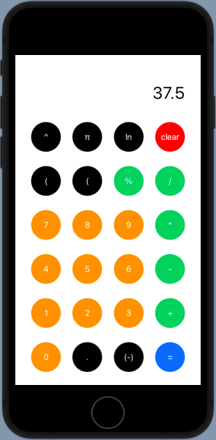

# Calculators



These are simple calculator apps designed for all web and mobile devices using a variety of app development tools. It's a showcase for how the same logic can apply to multiple development environments and how to write unit and UI tests on all these platforms.

## Directions

- [iOS](#ios)
- [Android](#android)
- [React Native](#react-native)
- [Flutter](#flutter)

### iOS

There are two iOS apps to check out. `Calculator-Storyboard` uses storyboards to create the UI and `Calculator-SwiftUI` uses SwiftUI to create the UI. Both can be run using Xcode on a Mac.

- **Storyboard:** Open `Calculator-Storyboard.xcodeproj` inside the `Calculator-Storyboard` directory. Unit tests are found in the `Calculator-StoryboardTests` directory. UI tests are found in the `Calculator-StoryboardUITests` directory.
- **SwiftUI:** Open `Calculator-SwiftUI.xcworkspace` (**not .xcodeproj**) inside the `Calculator-SwiftUI` directory. (Note: SwiftUI only works with iOS 13+ or Xcode 11+.) If there are any dependency issues, run `pod install` to install the necessary dependencies. Unit tests are found in the `Calculator-SwiftUITests` directory and leverage the [View Inspector](https://github.com/nalexn/ViewInspector) library to set up all the tests. UI tests are found in the `Calculator-SwiftUIUITests` directory.

### Android

Open `Calculator-Android` in Android Studio and run any of the necessary Gradle builds to run this app. Unit tests are found in the `Calculator-Android/app/src/test/*` directory. Instrumented (UI) tests are found in the `Calculator-Android/app/src/androidTest/*` directory.

### React Native

Go to the `Calculator-ReactNative` directory and run the following commands:

```
npm install
npm start
```

This will open Expo's Metro Bundler which will allow you to run the app in the browser, iOS simulator, or Android emulator. To run on a real device, install the [Expo Go](https://docs.expo.io/guides/testing-on-devices/#install-expo-go-from-a-devices-app) app and scan the QR Code on the bundler page. Unit tests are found in `calc-methods.test.ts` and UI tests are found in `Calculator.test.tsx`.

### Flutter

In Android Studio, make sure the Flutter and Dart plugins are installed. Then open `calculator_flutter`. [Follow the necessary steps](https://flutter.dev/docs/get-started/install) to run the app on a web browser or on an iOS or Android device/simulator. Unit tests are found in `calculator_unit_test.dart` and widget (UI) tests are found in `calculator_widget_test.dart`, both in the `calculator_flutter/test` directory.
